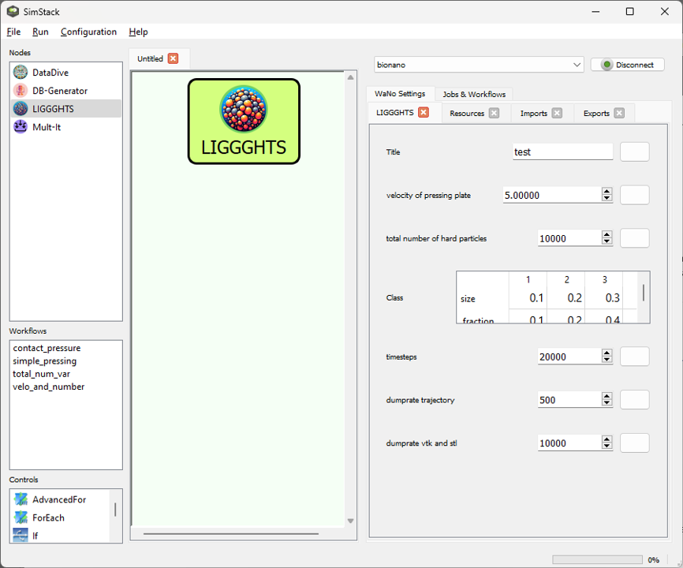
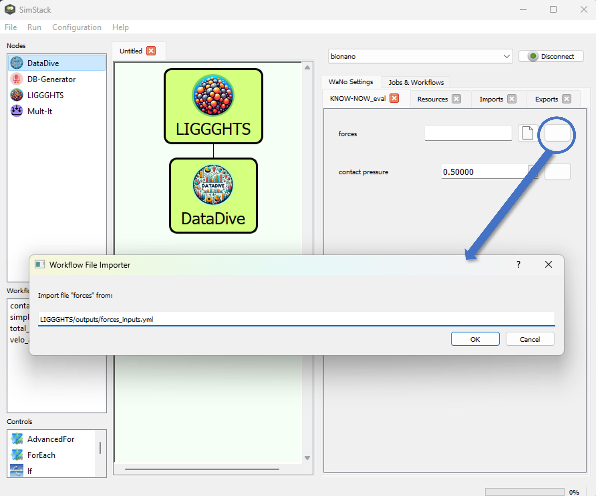

 

When publishing results obtained with LIGGGHTS WaNo, please consider citing it.

# LIGGGHTS and DataDive
---
These SimStack Wanos can be used to perform a pressing simulation with the DEM solver [LIGGGHTS](https://www.cfdem.com/liggghts-open-source-discrete-element-method-particle-simulation-code).
The LIGGGHTS WaNo creates a simulation input file using a preset template and the specified parameters. The DataDive Wano reads the results of LIGGGHTS and evaluates a stress-strain-curve.
---
# LIGGGHTS WaNo
This WaNo creates an input file named *workflow.inp* for a LIGGGTHS pressing simulation. In the simulation, a defined number of particles is created within a rectangular pressing die. After a short time to allow the particles to settle, the upper pressing plate moves downwards and presses on the particles with 100 MPa.  Two types of particles are specified, type 1 (*ceramic*) and type 2 (*polymer*). Polymer particles have a radius of 0.2 units.

## Parameters
The customizable parameters are from top to bottom:
- *Title*: An arbitrary title of this set of parameters.
- *velocity of pressing plate*: The velocity of the upper pressing plate moving downwards.
- *total number of hard particles*: The number of ceramic particles to be inserted. Should be max. 20000 to fit in the pressing die.
- *Class*: The particle size distribution of the ceramic particles can be defined in this table. To approximate a real size distribution, five sizes and the numerical fraction of each size fraction can be specified.
- *timesteps*: The number of timesteps for the pressing segment of the simulation. Depending on the filling height of the pressing die (cf. *total number of hard particles*), approx. 10000 timeseps are necessary to establish pressing contact.
- *dumprate trajectory*: LIGGGHTS calculates the trajectory (position) of every particle in every timestep. The trajectory file can be used to visualize the movement of the particles, e.g. using [OVITO](https://www.ovito.org/).  This parameter defines after how many time steps in the pressing segment of the simulation the position of all particles is recorded in the *dump.compression* file. Too small dumprates may create an unnecessarily large file. 
- *dumprate vtk and stl*: vtk and stl files can be used for the visualization of the pressing die and plates. This rate parameter determines after how many time steps in the pressing segment a vtk and an stl file with the corresponding positions are generated. Once the calculation is complete, all generated stl and vtk files are packed in a tar archive.

## Output

- *forces_inputs.yml*

# DataDive WaNo

This WaNo reads a *forces_inputs.yml* file created by the *LIGGGHTS* WaNo and evaluates a stress-strain curve from the data. For the calculation of strain, the initial thickness of the powder filling is determined based on a specified contact pressure.

## Parameters
- *forces*: Name and location of the *forces_inputs.yml*
- *contact pressure*: The stress in MPa at which the initial thickness of the powder filling is defined. Any data below the stress level is discarded for the stress-strain curve.

## Input

- *forces_inputs.yml*

## Output

- *datadive_result.yml*
- *stress-strain-curve.png*

# Auxiliary WaNos Mult-It and DB-Generator

- see [SimStack documentation](https://simstack.readthedocs.io/en/latest/wanos/auxiliary_wanos/index.html)
- iterators to use in *Mult-It*
   * single variable: list(range(Mult-It.VarI-begin, Mult-It.VarI-end, Mult-It.Step))
   * two variables: itertools.product( list(np.linspace( Mult-It.VarF-begin , Mult-It.VarF-end , Mult-It.N-points )), list(range( Mult-It.VarI-begin, Mult-It.VarI-end, Mult-It.Step)) )
- set name of the yml-database and GitHub Credentials for GitHub push in *DB-Generator*
- Colab notebook for data visualization 
